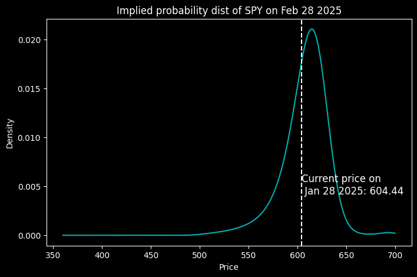
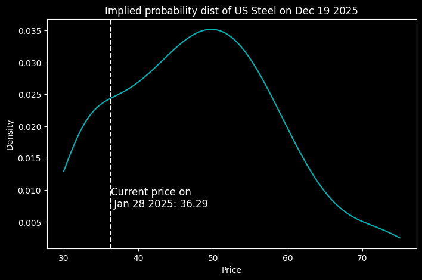

[](https://github.com/ambv/black)

This Python project generates probability density function (PDFs) and cumulative distribution functions (CDFs) for the future prices of stocks, as implied by (call) options prices. 

These probability distributions reflect market expectations but are not necessarily accurate predictions of future stock prices. 

If you believe in the efficient market hypothesis, then the probability distributions generated by this package represent the best available, risk-neutral estimates of future stock price movements, as they are derived from the collective information and expectations of market participants. They can serve as a useful tool for understanding market-implied uncertainty, skewness, and tail risks. 


<p align="center">
    
</p>


## Table of Contents

- [Installation](#installation)
- [Quick Start Guide](#Quick-Start-Guide)
- [Algorithm Overview](#algorithm-overview)
- [License](#license)


## Installation

```zsh
pip install oipd
```

Please note that this project requires Python 3.10 or later.


## Quick Start Guide

The file [`example.ipynb`](example.ipynb) is supplied as a demo.

<b>The user will need to specify 4 mandatory arguments:</b>

1. `input_csv_path`: a string containing the file path of the options data in a csv, with the columns 'strike', 'last_price', 'bid, 'ask'
2. `current_price`: a number of the underlying asset's current price
3. `days_foward`: a number of the days between the current date and the strike date
4. `risk_free_rate`: a number indicating the annual risk-free rate in nominal terms

<b>There are 4 additional optional arguments:</b>

5. `fit_kernel_pdf`: (optional) a True or False boolean, indicating whether to fit a kernel-density estimator on the resulting raw probability distribution. Fitting a KDE may improve edge-behavior of the PDF. Default is False
6. `save_to_csv`: (optional) a True or False boolean, where if True, the output will be saved to csv. Default is False
7. `output_csv_path`: (optional) a string containing the file path where the user wishes to save the results
8. `solver_method`: (optional) a string of either 'newton' or 'brent', indicating which solver to use. Default is 'brent'

<b>3 examples of options data is provided in the `data/` folder, downloaded from Yahoo Finance.</b>

Note that oipd only uses call options data for now. 

```python
from oipd import cli

# Example - SPY
input_csv_path = "path_to_your_options_data_csv"
current_price = 604.44
current_date = "2025-01-28"
strike_date = "2025-02-28"
# Convert the strings to datetime objects
current_date_dt = datetime.strptime(current_date, "%Y-%m-%d")
strike_date_dt = datetime.strptime(strike_date, "%Y-%m-%d")
# Calculate the difference in days
days_difference = (strike_date_dt - current_date_dt).days

spy_pdf = cli.generate_pdf.run(
    input_csv_path=input_csv_path,
    current_price=float(current_price),
    days_forward=int(days_difference),
    risk_free_rate=0.03,
    fit_kernel_pdf=True,
)
```


<b>Another interesting example is US Steel:</b>
<p align="center">
    
</p>

The market appears to expect a significant rise in U.S. Steel’s share price by December 2025, likely reflecting a consensus that federal regulators will approve Nippon Steel’s proposed $55 per share acquisition.

<i>Note that the domain (x-axis) is limited in this graph, due to (1) not many strike prices exist for US Steel, and (2) some extreme ITM/OTM options did not have solvable IVs.</i>


## Theory Overview

An option is a financial derivative that gives the holder the right, but not the obligation, to buy or sell an asset at a specified price (strike price) on a certain date in the future. Intuitively, the value of an option depends on the probability that it will be profitable or "in-the-money" at expiration. If the probability of ending "in-the-money" (ITM) is high, the option is more valuable. If the probability is low, the option is worth less.

As an example, imagine Apple stock (AAPL) is currently $150, and you buy a call option with a strike price of $160 (meaning you can buy Apple at $160 at expiration).
- If Apple is likely to rise to $170, the option has a high probability of being ITM → more valuable
- If Apple is unlikely to go above $160, the option has little chance of being ITM → less valuable

This illustrates how option prices contain information about the probabilities of the future price of the stock (as determined by market expectations). By knowing the prices of options, we can reverse-engineer and extract information contained about probabilities. 

For a simplified worked example, see this [excellent blog post](https://reasonabledeviations.com/2020/10/01/option-implied-pdfs/).
For a complete reading of the financial theory, see [this paper](https://www.bankofengland.co.uk/-/media/boe/files/quarterly-bulletin/2000/recent-developments-in-extracting-information-from-options-markets.pdf?la=en&hash=8D29F2572E08B9F2B541C04102DE181C791DB870).


## Algorithm Overview

The process of generating the PDFs and CDFs is as follows:

1. For an underlying asset, options data along the full range of strike prices are read from a CSV file to create a DataFrame. This gives us a table of strike prices along with the last price[^1] each option sold for
2. Using the Black-Sholes formula, we convert strike prices into implied volatilities (IV)[^2]. IV are solved using either Newton's Method or Brent's root-finding algorithm, as specified by the `solver_method` argument. 
3. Using B-spline, we fit a curve-of-best-fit onto the resulting IVs over the full range of strike prices[^3]. Thus, we have extracted a continuous model from discrete IV observations - this is called the volatility smile
4. From the volatility smile, we use Black-Scholes to convert IVs back to prices. Thus, we arrive at a continuous curve of options prices along the full range of strike prices
5. From the continuous price curve, we use numerical differentiation to get the first derivative of prices. Then we numerically differentiate again to get the second derivative of prices. The second derivative of prices multiplied by a discount factor $\exp^{r*\uptau}$, results in the probability density function [^4]
6. We can fit a KDE onto the resulting PDF, which in some cases will improve edge-behavior at very high or very low prices. This is specified by the argument `fit_kernal_pdf`
7. Once we have the PDF, we can calculate the CDF


[^1]: We chose to use last price instead of calculating the mid-price given the bid-ask spread. This is because Yahoo Finance, a common source for options chain data, often lacks bid-ask data. See for example [Apple options](https://finance.yahoo.com/quote/AAPL/options/)
[^2]: We convert from price-space to IV-space, and then back to price-space as described in step 4. See this [blog post](https://reasonabledeviations.com/2020/10/10/option-implied-pdfs-2/) for a breakdown of why we do this double conversion
[^3]: See [this paper](https://edoc.hu-berlin.de/bitstream/handle/18452/14708/zeng.pdf?sequence=1&isAllowed=y) for more details. In summary, options markets contains noise. Therefore, generating a volatility smile through simple interpolation will result in a noisy smile function. Then converting back to price-space will result in a noisy price curve. And finally when we numerically twice differentiate the price curve, noise will be amplified and the resulting PDF will be meaningless. Thus, we need either a parametric or non-parametric model to try to extract the true relationship between IV and strike price from the noisy observations. The paper suggests a 3rd order B-spline as a possible model choice
[^4]: For a proof of this derivation, see this [blog post](https://reasonabledeviations.com/2020/10/10/option-implied-pdfs-2/)


## Feedback and Contributing

Feedback is most welcome! I'd love to hear about how you make use of this information, what are the use cases, and what further features you want to see. Email me at tyrneh@gmail.com to chat. 

Contributions are also welcome. Please fork the repository, make your changes, and submit a pull request.


## License

This project is a preview, it is not currently licensed. Not financial advice.

THE SOFTWARE IS PROVIDED “AS IS”, WITHOUT WARRANTY OF ANY KIND, EXPRESS OR IMPLIED, INCLUDING BUT NOT LIMITED TO THE WARRANTIES OF MERCHANTABILITY, FITNESS FOR A PARTICULAR PURPOSE AND NONINFRINGEMENT. IN NO EVENT SHALL THE AUTHORS OR COPYRIGHT HOLDERS BE LIABLE FOR ANY CLAIM, DAMAGES OR OTHER LIABILITY, WHETHER IN AN ACTION OF CONTRACT, TORT OR OTHERWISE, ARISING FROM, OUT OF OR IN CONNECTION WITH THE SOFTWARE OR THE USE OR OTHER DEALINGS IN THE SOFTWARE.
