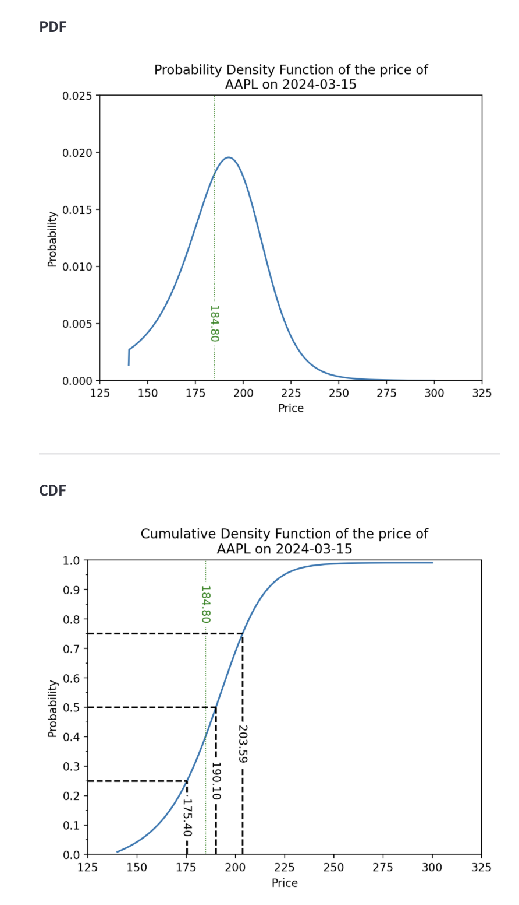

[](https://github.com/ambv/black)

This Python project generates future-looking probability density function (PDFs) and cumulative distribution functions (CDFs) for the prices of publicly traded securities using options data. The output is visualized with matplotlib, and the project also includes a user-friendly web-based dashboard interface built with Streamlit.

## Table of Contents

- [Installation](#installation)
- [Usage](#usage)
- [Algorithm Overview](#algorithm-overview)
- [License](#license)

## Installation

1. Clone the repo

```bash
git clone https://github.com/jmholzer/probabilistic-pdfs.git
```

2. Navigate to the project directory

```bash
cd probabilistic-pdfs
```

3. Install Python dependencies

```bash
pip install -r requirements.txt
```

4. Install the project

```bash
pip install .
```

Please note that this project requires Python 3.10 or later.

## Usage

To start the web-based dashboard, run the following command:

```bash
probabilistic
```

This will start a local web server and you should be able to access the dashboard in your web browser at `localhost:8501`.

The user will need to provide their own options data in a CSV file with the columns 'strike', 'bid', 'ask', and 'last_price'. Sample data for SPY can be found in the `data` folder.

## Theory Overview

An option is a financial derivative that gives the holder the right, but not the obligation, to buy or sell an asset at a specified price (strike price) on a certain date in the future. Intuitively, the value of an option depends on the probability that it will be profitable or "in-the-money" at expiration. 

Why? Consider this scenario: You possess an option to sell a stock for $100 tomorrow, and as of the market's close today, the stock's price stands at $10. Intuitively, this option appears to hold significant value due to the high likelihood of its exercise. However, if it were certain that the stock's price would surge to $200 at the opening bell tomorrow, the chance of exercising your option profitably drops to zero. Consequently, the option's value evaporates. This illustrates how the price of an option is linked to the probability of its being in the money—that is, the likelihood that the option can be exercised at a profit. Consequently, by knowing the price of an option, we can work backwards to calculate the consensus probability of its future price. 

To recap, the price of an option reflects the market's collective expectation about the future price of the underlying asset, and is inherently tied to the probability of its outcome (the option being in-the-money) occuring. 
By working backwards, we can solve for the probability of outcomes occuring along a continuum of strike prices, and thus generate a PDF of the market's collective expectation of the future price of the underlying asset. 

For a simplified worked example, see this [excellent blog post](https://reasonabledeviations.com/2020/10/10/option-implied-pdfs-2/).
For a complete reading of the financial theory, see [this paper](https://www.bankofengland.co.uk/-/media/boe/files/quarterly-bulletin/2000/recent-developments-in-extracting-information-from-options-markets.pdf?la=en&hash=8D29F2572E08B9F2B541C04102DE181C791DB870).

## Algorithm Overview

The process of generating the PDFs and CDFs is as follows:

1. For an underlying asset, options data along the full range of strike prices are read from a CSV file to create a DataFrame. This gives us a table of strike prices along with the last price[^1] each option sold for
2. Using the Black-Sholes formula, we convert strike prices into implied volatilities (IV)[^2]
3. Using B-spline, we fit a curve-of-best-fit onto the discrete observations of IV over the full range of strike prices[^3]. Thus, we have extracted a continuous model from discrete IV observations - this is called the volatility smile
4. From the volatility smile, we use Black-Scholes to convert IVs back to prices. Thus, we arrive at a continuous curve of options prices along the full range of strike prices
5. From the continuous price curve, we use numerical differentiation to get the first derivative of prices. Then we numerically differentiate again to get the second derivative of prices. The second derivative of prices multiplied by a discount factor $\exp^{r*\uptau}$, results in the probability density function [^4]
6. Once we have the PDF, we can calculate the CDF
7. Quartiles (25th, 50th, and 75th percentiles) of each distribution are also derived

[^1] We chose to use last price instead of calculating the mid-price given the bid-ask spread. This is because Yahoo Finance, a common source for options chain data, often lacks bid-ask data. See for example [Apple options](https://finance.yahoo.com/quote/AAPL/options/)
[^2] We convert from price-space to IV-space, and then back to price-space as described in step 4. See this [blog post](https://reasonabledeviations.com/2020/10/10/option-implied-pdfs-2/) for a breakdown of why we do this double conversion
[^3] See [this paper](https://edoc.hu-berlin.de/bitstream/handle/18452/14708/zeng.pdf?sequence=1&isAllowed=y) for more details. In summary, options markets contains noise. Therefore, generating a volatility smile through simple interpolation will result in a noisy smile function. Then converting back to price-space will result in a noisy price curve. And finally when we numerically twice differentiate the price curve, noise will be amplified and the resulting PDF will be meaningless. Thus, we need either a parametric or non-parametric model to try to extract the true relationship between IV and strike price from the noisy observations. The paper suggests a 3rd order B-spline as a possible model choice
[^4] For a proof of this derivation, see again this [blog post](https://reasonabledeviations.com/2020/10/10/option-implied-pdfs-2/)

## Examples

An example of the input and output for the sample AAPL options chain data for the expiry date of Mar 15 2024 (taken on Nov 14 2023)  included in `data/` is:




## License

This project is a preview, it is not currently licensed. Not financial advice.

THE SOFTWARE IS PROVIDED “AS IS”, WITHOUT WARRANTY OF ANY KIND, EXPRESS OR IMPLIED, INCLUDING BUT NOT LIMITED TO THE WARRANTIES OF MERCHANTABILITY, FITNESS FOR A PARTICULAR PURPOSE AND NONINFRINGEMENT. IN NO EVENT SHALL THE AUTHORS OR COPYRIGHT HOLDERS BE LIABLE FOR ANY CLAIM, DAMAGES OR OTHER LIABILITY, WHETHER IN AN ACTION OF CONTRACT, TORT OR OTHERWISE, ARISING FROM, OUT OF OR IN CONNECTION WITH THE SOFTWARE OR THE USE OR OTHER DEALINGS IN THE SOFTWARE.
